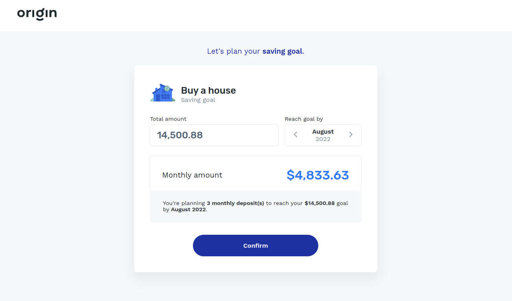

## Origin Frontend Take-Home Assignment

This project was bootstrapped with [Create React App](https://github.com/facebook/create-react-app).
It uses the following technologies:

- Jest and React Testing Library
- date-fns for manipulating dates
- react-imask for masking/formatting input
- styled-components for styling
- prop-types for props validation
- ESLint for linting
- Prettier for formatting

Next steps:

- [ ] Refactor to TypeScript
- [ ] Improve currency and date manipulation
- [ ] Improve test coverage

### How to run this project

In the project directory, run:

#### `yarn`

Installs all dependencies of the project.

#### `yarn start`

Runs the app in the development mode. Open [http://localhost:3000](http://localhost:3000) to view it in your browser.

### Available scripts

There's a few useful scripts that you can run:

#### `yarn test`

Runs all tests.

#### `yarn lint`

Shows linting errors on the console.

#### `yarn lint:format`

Format errors with ESLint.

#### `yarn build`

Builds the app for production to the `build` folder.
